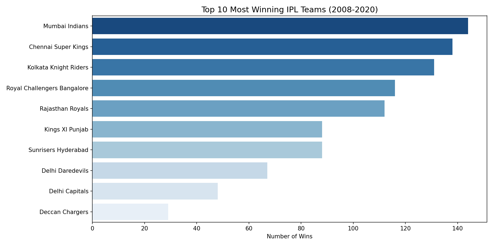
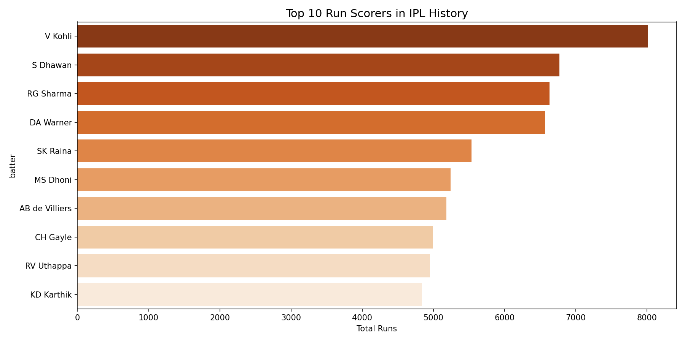
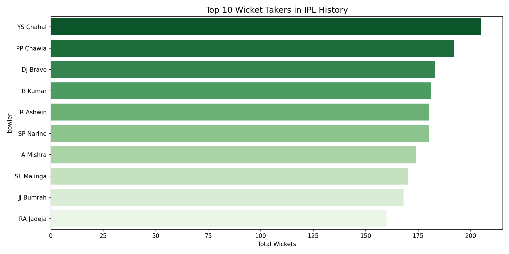
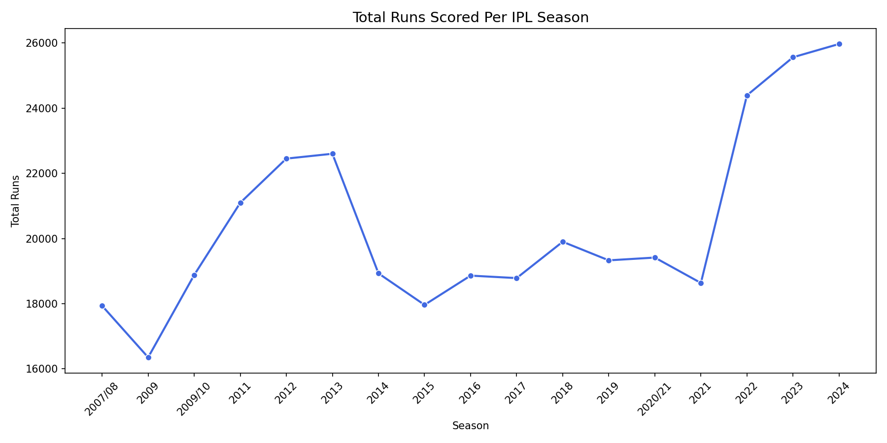

# IPL Data Analysis — Match & Player Performance (2008–2024)

## Project Overview
This project analyzes 17 seasons of IPL cricket data — 1,090 matches and 260,920 
ball-by-ball deliveries — to answer real questions about team performance, player 
dominance, toss impact, and how the game has evolved over time.

The dataset comes from official IPL records covering every match from 2008 to 2024.

---

## Business Questions Answered
- Which teams have been the most consistently successful?
- Does winning the toss actually help you win the match?
- Who are the greatest batsmen and bowlers in IPL history?
- Is IPL batting getting more aggressive over the years?

---

## Dataset
| File | Description | Size |
|---|---|---|
| matches.csv | One row per match — teams, toss, result, venue | 1,095 rows |
| deliveries.csv | One row per ball bowled — runs, wickets, players | 260,920 rows |

Source: Kaggle — IPL Complete Dataset 2008–2024

---

## Tools Used
- Python 3
- Pandas — data cleaning and analysis
- Matplotlib — visualizations
- Seaborn — statistical charts

---

## Key Findings

### 1. Team Performance
Mumbai Indians lead all-time with 144 wins, followed closely by 
Chennai Super Kings with 138. These two franchises have won more 
matches than any other team by a significant margin.



### 2. The Toss Myth
Winning the toss converts to a match win only 50.8% of the time — 
statistically identical to a coin flip. Despite this, 700 out of 
1,090 teams chose to field first after winning the toss, showing 
a strong preference for chasing that does not translate into 
a measurable advantage.

### 3. Top Run Scorers
Virat Kohli leads all-time with 8,014 runs — 1,245 runs ahead of 
second place Shikhar Dhawan (6,769). The top 5 scorers have all 
crossed 5,000 runs, showing remarkable consistency over many seasons.



### 4. Top Wicket Takers
Yuzvendra Chahal leads with 205 wickets, followed by Piyush Chawla 
(192) and DJ Bravo (183). The dominance of spinners and medium-pace 
bowlers in the top 10 reflects IPL pitch and conditions.



### 5. Season Scoring Trends
Total runs per season grew from 17,937 in 2008 to 25,971 in 2024 — 
a 45% increase over 17 years. This reflects bigger boundaries, 
better batting talent, and more aggressive playing styles entering 
the league over time.



---

## How to Run

1. Clone this repository
2. Install dependencies:
```
pip install pandas matplotlib seaborn
```
3. Make sure matches.csv and deliveries.csv are in the same folder
4. Run:
```
python ipl_analysis.py
```

---

## Project Structure
```
ipl-data-analysis/
│
├── ipl_analysis.py       # Main analysis script
├── matches.csv           # Match level data
├── deliveries.csv        # Ball by ball data
├── team_wins.png         # Chart — top winning teams
├── top_batsmen.png       # Chart — top run scorers
├── top_bowlers.png       # Chart — top wicket takers
├── season_trends.png     # Chart — runs per season
└── README.md             # This file

Dataset source: https://www.kaggle.com/datasets/patrickb1912/ipl-complete-dataset-20082020
Download the CSV files from Kaggle and place them in the same folder before running.
```

---

## Author
**Harsha Vardhan Chittapragada**  
Data Analyst | SQL · Python · Power BI  
Hyderabad, India  
[LinkedIn](https://linkedin.com/in/harshavardhan-chittapragada) | 
[GitHub](https://github.com/harshavardhan-chittapragada-max)
